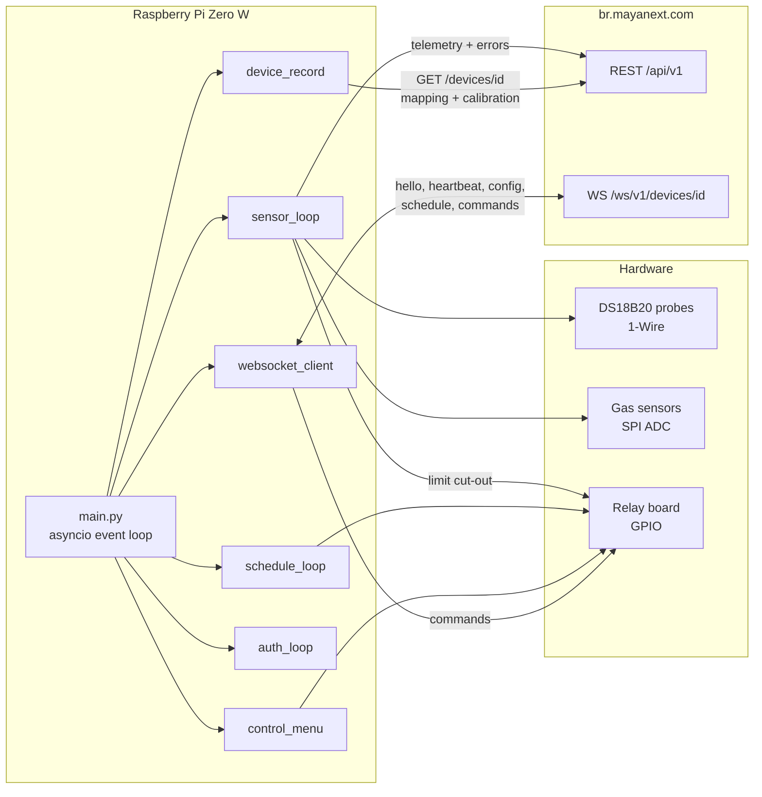
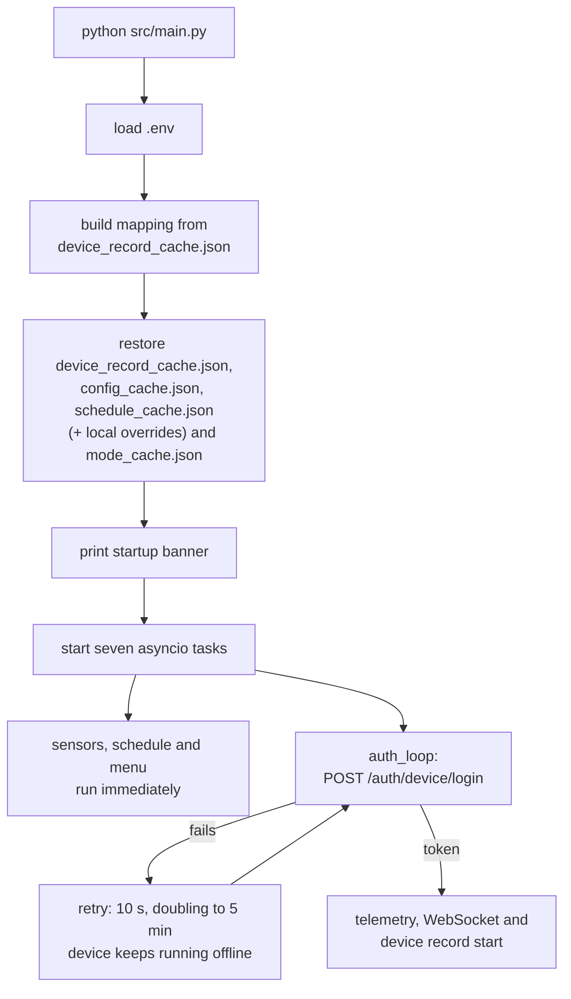
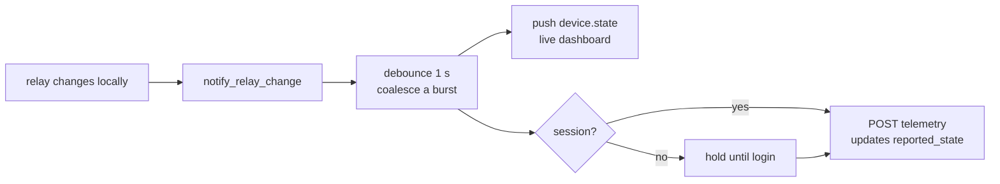
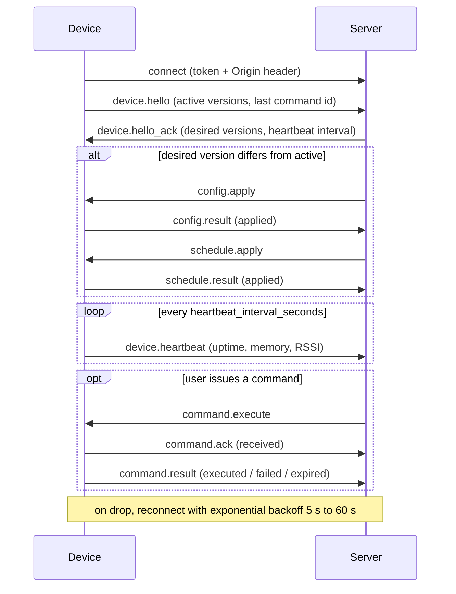
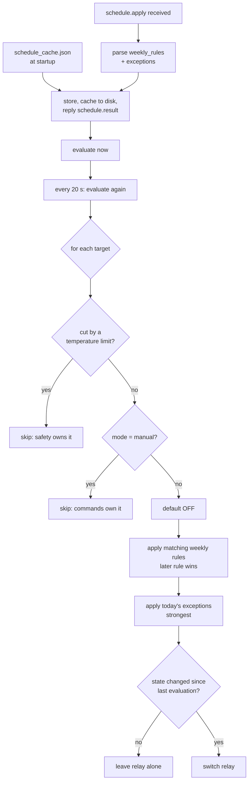
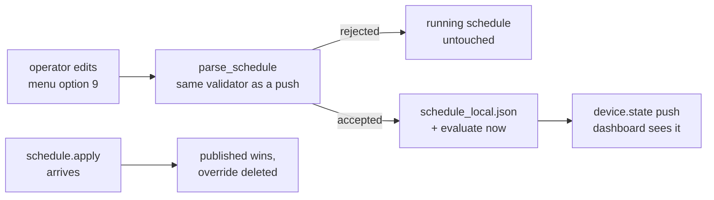
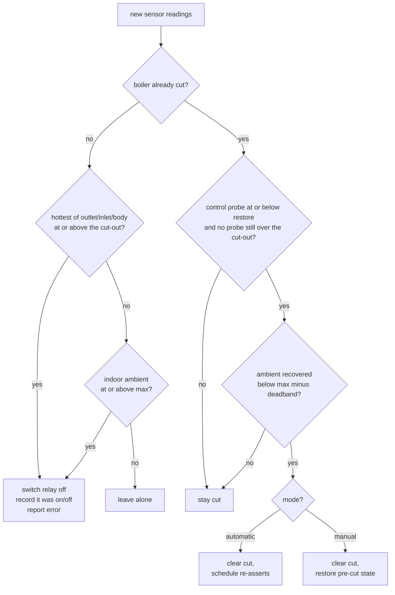

# boilerRoom-edge

Edge agent for the Smart Boiler Room platform. It runs on a Raspberry Pi in the
boiler room, reads temperature and gas sensors, drives relays, and keeps a live
link to the cloud over REST and WebSockets.

Server-side API contract: [`DEVICE.md`](DEVICE.md).

- **Target hardware:** Raspberry Pi Zero W — single-core ARMv6, 512 MB RAM, SD card
- **Python:** 3.11+ (uses `datetime.UTC`)
- **Dependencies:** `websockets`, `tzdata` (plus `RPi.GPIO` and `spidev` on real hardware)
- **Concurrency:** one asyncio event loop; every blocking call goes through
  `asyncio.to_thread` so nothing stalls the loop

---

## System overview



Seven tasks run concurrently for the life of the process:

| Task | Responsibility |
|------|----------------|
| `sensor_loop` | Read all sensors, store history, report faults, enforce temperature limits, post telemetry |
| `websocket_client` | Realtime channel: hello, heartbeat, config, schedule, commands |
| `schedule_loop` | Re-evaluate the active schedule every 20 s and switch relays |
| `control_menu` | Interactive terminal menu for local inspection and control |
| `auth_loop` | Obtain a device session, retrying in the background until it succeeds |
| `device_record` | Poll `GET /devices/<id>` for calibration, sensor enable flags and cloud intent |
| `state_publisher` | Report local relay changes to the server at once, instead of at the next post |

---

## Startup



**Startup never depends on the server being reachable.** Login runs as a
background task, so a boiler room that reboots during an outage still comes up
and runs its heating programme from the cached schedule. Telemetry and the
WebSocket wait on the session rather than blocking the boot; sensor polling,
schedule control, limit enforcement, reading history, and the control menu all
work without one. Missing credentials are reported once and not retried, since no
amount of waiting will supply them.

The device session token is used for **both** REST
(`Authorization: Device <token>`) and the WebSocket. There is no refresh
endpoint for devices — when the token nears expiry, or the server answers 401,
the agent simply logs in again.

---

## Sensor cycle


Limits are enforced *before* telemetry is built, so a cut is reported in the
same cycle it happens.

Telemetry is posted **once a minute**, and sensors are read on the same
one-minute cycle. `telemetry_interval_seconds` from the server config overrides
the posting cadence once one has been received.

The due-check runs with a few seconds of slack, because it only happens on
read-cycle boundaries. With the read interval equal to the telemetry interval,
a cycle landing a second early would fail a strict comparison and defer the
post to the next cycle — quietly turning a one-minute cadence into two.

The first cycle after boot posts immediately rather than waiting out the
interval, so a restart is visible on the server straight away.

Measured cadence over a five-post run: 59.4, 60.8, 61.0, 60.7 s. The server
records `captured_at` from the payload, so the spacing is recorded accurately
rather than assumed.

> **The read interval also bounds how fast the over-temperature cut reacts.**
> The limit guard runs once per sensor cycle, so at 60 s a boiler can sit over
> its maximum for up to a minute before being switched off — it was 10 s
> before. If that latency matters for your installation, either lower
> `DEFAULT_READ_INTERVAL` or give the limit guard its own faster poll.

The envelope follows the schema in `DEVICE.md`: `sensor_readings` with
`value`/`unit`/`status`, `boiler_states` and `pump_states` with `state` and
`mode`, the active config and schedule versions, `uptime_seconds`, and
`network` (`type`, `rssi_dbm`) where the host exposes a wireless interface.
Readings also carry `role`, `boiler_index`, and `equipment_unit` — additive
fields outside the documented schema that let the server correlate a reading
with the physical installation.

`errors` is deliberately **not** included. Errors go to
`POST /devices/<id>/errors`, where each entry is documented to become an alert;
repeating them in telemetry risks duplicates, and an empty `errors: []` on a
device that has just reported a fault would be misleading.

`device_status` is `normal`, `degraded` (a sensor is unavailable), or `unknown`
(no readings yet). The server stores this string without validating it, so the
vocabulary in `DEVICE.md` is the only guide.

### Reporting local relay changes

A unit's `reported_state` on the server comes from telemetry `boiler_states` /
`pump_states` and from nothing else. Waiting for the next scheduled post made
local changes take up to a minute to appear, while a change made *from* the
cloud arrived instantly as a WebSocket command — an asymmetry that looked like
a bug from the dashboard.

So anything that switches a relay locally — the control menu, a schedule
transition, a temperature cut, an executed command — announces it, and the
`state_publisher` task posts telemetry straight away:



Two limits keep this cheap on a Pi Zero W, where every POST costs a TLS
handshake on one ARMv6 core: a **1 s debounce**, so a schedule tick switching
four relays sends one post, and a **5 s floor** between change-driven posts, so
a burst of toggles cannot become a stream of handshakes. The regular cadence is
untouched, and an immediate post resets the interval clock so the sensor loop
does not duplicate it.

`device.state` goes out alongside, over the already-open WebSocket. It is not a
substitute: `DEVICE.md` defines it as a live dashboard push
(`dashboard.state_changed`), and only telemetry settles the stored
`reported_state`.

A change made before login is **held**, not dropped — at boot the schedule
switches relays a second or two before the session exists.

Measured end to end: an operator toggle through the control menu reached the
server **1.4 s** later; relay changes at boot, **1.9 s**. Both were 60–70 s
before.

### When a post fails: the outbox

A failed telemetry post used to be gone — logged, and the readings never sent.
Now the envelope is written to a `telemetry_outbox` table with
`sync_to_server = 0` and retried later. It is replayed **verbatim**, so its
original `captured_at` is what the server records: the history shows when the
readings were taken, not when the link came back.

```sql
telemetry_outbox(id, captured_at, envelope, sync_to_server,
                 attempts, last_error, queued_at, synced_at)
```

On a successful replay the row flips to `sync_to_server = 1` with `synced_at`
stamped, and ages out with the readings under the same retention window.

**Ordering is the subtle part.** `boiler_states` / `pump_states` set the
server's `reported_state`, so a queued envelope delivered *after* a newer one
would rewind the cloud's view of the relays. Two rules prevent it:

* every send goes through one lock, and the backlog drains oldest-first
  before the live post;
* if the backlog cannot be drained, the live envelope is **queued too** rather
  than sent ahead of it.

The queue drains at 10 envelopes per send — each is a separate TLS handshake on
one ARMv6 core, so a day's outage clears in roughly two hours instead of
monopolising a cycle. Two limits keep a long outage from taking the card with
it: `BOILERROOM_OUTBOX_MAX_PENDING` (5,000 rows, about 7 MB and three days)
drops the oldest on overflow, and `BOILERROOM_OUTBOX_MAX_ATTEMPTS` (5) sets a
row aside so one envelope the server always rejects cannot block everything
behind it. Set-aside rows show as `stuck` in menu option 3.

Verified against the live server: an envelope queued with a `captured_at` ten
minutes in the past was replayed and the server stored it under that original
timestamp, not the delivery time.

---

## WebSocket session



The session is long-lived: it stays open and is kept alive by the heartbeat at
the interval `hello_ack` asks for (30 s). Reconnects back off exponentially from
5 s to 60 s, resetting once a session has survived 30 s — each attempt costs a
full TLS handshake, which is expensive on the Pi Zero W's single ARMv6 core, so
a server that rejects connections must not turn into a reconnect storm.

**Origin header is required.** The server runs Channels'
`AllowedHostsOriginValidator`, which rejects a handshake carrying no `Origin`
with `HTTP 403` *before* authentication is checked. Non-browser clients send
none by default, so the agent always sends one (`BOILERROOM_WS_ORIGIN`).

Implemented messages:

| Direction | Messages |
|-----------|----------|
| Device → server | `device.hello`, `device.heartbeat`, `command.ack`, `command.result`, `config.result`, `schedule.result`, `device.state` |
| Server → device | `device.hello_ack`, `config.apply`, `schedule.apply`, `command.execute` |

Supported commands: `boiler.turn_on/off`, `boiler.set_mode`, `pump.turn_on/off`,
`pump.set_mode`, `device.request_state`, `device.restart_service`,
`alarm.acknowledge_local`.

Command outcomes are cached by `command_id` (last 64) and replayed rather than
re-executed, because the server re-dispatches queued commands after every hello.

---

## Schedule evaluation



Two properties worth knowing:

- **Edge-triggered.** A relay is switched only when the computed state
  *changes*. A manual toggle from the control menu therefore survives until the
  next schedule transition instead of being reverted seconds later.
- **Mode-gated.** A unit in `manual` is out of schedule control entirely;
  `automatic` hands it back and re-asserts immediately.

Targets map to relays through the device mapping: boiler *N* → unit `pot_N` → the
relay with role `pot`; pump *N* → the relay with role `pump`.

### Changing the programme on the device

Schedules are published from the cloud, but an operator standing in the boiler
room has to be able to change how the boilers run without it — the same
argument that put control modes on the device. A site whose uplink is dead, or
a room being commissioned before anything has been published, still needs its
programme in someone's hands.

**Control-menu option 9** adds and removes weekly rules and date exceptions:

```
--- Change schedule ---
  1) Add a weekly rule        4) Remove a date exception
  2) Remove a weekly rule     5) Discard local edits
  3) Add a date exception     0) Back
```

An edit is a mutation of the raw `schedule.apply` document, handed straight to
`parse_schedule` — so a programme built here passes exactly the checks a server
push does, and a rejected edit leaves the running schedule untouched. There is
no second, weaker validator to drift out of step. A device with no schedule at
all starts one from scratch at version 0.



Precedence is one-way and deliberate: **a local edit holds until the server
publishes a schedule**, and that publish then wins and deletes the override.
Publishing is an explicit act by whoever owns the room, so it outranks
something typed on the device — but it is logged at WARNING rather than done
quietly, because an operator who set a programme by hand needs to know it is
gone.

**The version number is not bumped.** `DEVICE.md` has no device → server
schedule API, so the cloud cannot be told about an edit; raising the version
would only make the server notice a mismatch on the next hello and re-push,
undoing the operator's change. The device therefore keeps reporting the
*published* `schedule_version`, which leaves a divergence the server cannot
see. Everything that can show it does: the menu header, the log at WARNING on
every edit and at every boot, and `schedule_locally_modified` in the
`device.state` push, so a dashboard can flag the room.

**Edits survive a restart.** They are written to `schedule_local.json`,
atomically, separately from `schedule_cache.json` — the published document has
to stay intact for "discard local edits" to have something to put back. At boot
the override is restored only while it still sits on the version it was made
against; if the server published something newer while the device was off, that
publish outranks the edits and they are dropped with a line saying so. A cache
that cannot be *written* logs a warning and the edit still takes effect — it
simply will not survive a restart, which the menu says at the time.

```
schedule_local.json
{"saved_at": "...", "based_on_version": 25, "revision": 3, "schedule": { ... }}
```

Exceptions added here are numbered `local-1`, `local-2` …, so an operator can
tell their own one-offs from the ones that came down with a published schedule.
Each prompt is a blocking read that can sit for minutes, so the schedule is
re-checked before an edit is applied: if a push landed while you were typing,
nothing is saved and the menu says so rather than silently undoing it.

### Control modes

Every boiler and pump is in one of two modes, **per unit** — there is no
device-wide switch, so boiler 1 can be under maintenance while boiler 2 follows
the programme:

| Mode | Who drives the relay |
|------|----------------------|
| `automatic` (default) | The schedule |
| `manual` | Commands only — the schedule leaves it alone |

Set either from the server (`boiler.set_mode` / `pump.set_mode`) or **on the
device** through control-menu option 7 — an operator standing in the boiler
room should not need the cloud to take a boiler off the schedule. Both paths do
the same thing, persist the same way, and are reported to the server within a
second or two. Switching back to `automatic` calls `forget()` so the schedule
re-asserts on the next tick rather than waiting for the next start/end
boundary. The limit guard respects the mode too:
after a cut clears, a manual unit is put back exactly where the operator left
it, while an automatic one is handed to the schedule.

**Modes survive a restart.** They are written to `mode_cache.json` whenever one
changes — a rare, operator-driven event — and restored before the first
schedule evaluation. Without this, a reboot returned every unit to schedule
control: a boiler switched off by hand for maintenance would fire up again
after a power blip, with nothing in the log to explain it.

The cache is written atomically like the others, and degrades quietly: a
missing, corrupt or partly invalid file simply leaves the units it cannot
describe on `automatic`, and a cache that cannot be *written* logs a warning
without failing the command that changed the mode.

```
mode_cache.json
{"saved_at": "...", "modes": {"boiler:1": "manual", "pump:2": "manual"}}
```

---

## Temperature limits

The limits in `config.apply` are enforced on every read cycle. A boiler is cut
when it gets too hot and comes back once it has cooled — the gap between the two
is a deadband, so a boiler sitting at the limit does not chatter on and off.

### Two probe topologies

How the cut-out is derived from `max_water_temperature_c` depends on how many
probes the installation gives the unit, because with one probe you cannot tell
flow from return:

| Probes on the unit | `max_water_temperature_c` is | Cut at | Restore at |
|---|---|---|---|
| **Two or more** (inlet/outlet/body) | a **ceiling** | `max` | `min_water_temperature_c`, or `max −` `BOILERROOM_WATER_DEADBAND` (5 °C) when the server sends no minimum |
| **One** | the **target** it is held at | `max +` `BOILERROOM_SINGLE_PROBE_BAND` (3 °C) | `max −` the same band |

With this installation's config (`max_water_temperature_c: 80`, no minimum):

```
boiler 1: probes boiler_body                            cut 83.0 °C, restore 77.0 °C  [single probe, ±3 °C]
boiler 2: probes boiler_body                            cut 83.0 °C, restore 77.0 °C  [single probe, ±3 °C]
boiler 5: probes boiler_input_water, boiler_output_water cut 80.0 °C, restore 75.0 °C
```

> A single-probe boiler is therefore allowed to run up to one band **above**
> `max_water_temperature_c` before it is cut. That is deliberate — the
> configured value is a setpoint for that topology, not a ceiling — but it is
> the one place where the number in the cloud is not an upper bound. Lower
> `BOILERROOM_SINGLE_PROBE_BAND` to 0 to make it one.

**The topology is read from the mapping, never from which probes happen to be
readable this cycle.** Deciding it from live readings would let a failed outlet
probe quietly move a two-probe boiler onto the single-probe band — changing a
safety threshold because of a fault.

A boiler the mapping gives no probe at all, or that the config gives no maximum
for, has **no over-temperature cut**, and says so at WARNING on the transition
(and retracts it once fixed). This is not hypothetical: boilers 1 and 2 here
have a single `boiler_body` probe, which the cut did not look at at all until
`boiler_body` was added to the roles it trips on — they ran unprotected, and
nothing said so.



A cut outranks everything: the scheduler will not switch a cut boiler on,
`boiler.turn_on` is refused, and the control menu refuses to toggle it.

Sensor selection matters:

- **Cut** uses the *hottest* of the unit's outlet, inlet and body probes, so a
  runaway on any of them trips.
- **Restore** uses the *control* probe, in order of preference: **outlet, then
  body, then inlet**. Outlet is what the boiler is actually delivering and body
  is the next best proxy for it; inlet comes last because return water commonly
  sits above the restore point, and judging recovery on it would hold a boiler
  off indefinitely. Judging on the *hottest* probe would do the same. A cut
  additionally will not clear while any probe is still at or above the cut-out,
  so a stuck-hot sensor cannot cause chatter.
- **Ambient** uses `environment_inside` only. Outdoor temperature must never cut
  a boiler.

An unavailable sensor never counts as a cool boiler: a cut cannot clear without
a reading. It does not trip a cut by itself either, to avoid nuisance trips on a
flaky 1-Wire bus — the missing reading is reported as a sensor fault instead.

### Changing the limits on the device

**Control-menu option 10** sets `max_water_temperature_c`,
`min_water_temperature_c` and `max_ambient_temperature_c` locally — the same
argument as options 7 and 9: an operator in the boiler room should not need the
cloud to change how the boilers are protected.

It works exactly like the schedule editor. The edit mutates the raw
`config.apply` document and is handed to `parse_config`, so it passes the same
checks a push does; a rejected edit leaves the running limits untouched. Edits
are written to `config_local.json`, kept separately from `config_cache.json` so
they can be discarded, and restored at boot only while they still sit on the
published version they were made against. **A published config supersedes
them**, logged at WARNING. The version is not bumped, for the same reason as
the schedule — there is no device → server config API — so the divergence is
surfaced in the menu, the log, and `config_locally_modified` on `device.state`.

Because these are safety numbers, two things are checked that a server document
is trusted for: a value must be within 0–200 °C, and a minimum must sit below
the maximum (otherwise a cut boiler could never recover).

The menu shows the resulting per-boiler cut-outs after every change, since the
configured value is not the cut-out for a single-probe unit:

```
[menu] Limits updated — max water temperature 70 °C.
  Limits:
    boiler 1: ok; probes boiler_body; cut 73.0 °C, restore 67.0 °C  [single probe, ±3 °C]
    boiler 2: ok; probes boiler_body; cut 73.0 °C, restore 67.0 °C  [single probe, ±3 °C]
    boiler 5: ok; probes boiler_input_water, boiler_output_water; cut 70.0 °C, restore 65.0 °C
```

---

## Configuration

### `.env`

Copy `.env.example` to `.env` and fill in the device credentials. The file is
git-ignored.

| Variable | Default | Purpose |
|----------|---------|---------|
| `BOILERROOM_DEVICE_USERNAME` | — | Numeric device username from provisioning |
| `BOILERROOM_DEVICE_PASSWORD` | — | Numeric device password |
| `BOILERROOM_API_BASE_URL` | `https://br.mayanext.com` | REST base |
| `BOILERROOM_WS_BASE_URL` | `wss://br.mayanext.com` | WebSocket base |
| `BOILERROOM_WS_ORIGIN` | derived from WS base | `Origin` header for the handshake |
| `BOILERROOM_DEVICE_ID` | from login response | Pin the id used in REST/WS paths |
| `BOILERROOM_TOKEN_EXPIRY_BUFFER` | `60` | Re-login this long before token expiry |
| `BOILERROOM_WS_RECONNECT_DELAY` | `5` | Initial reconnect delay |
| `BOILERROOM_WS_RECONNECT_MAX_DELAY` | `60` | Backoff ceiling |
| `BOILERROOM_WS_SESSION_STABLE` | `30` | Session lifetime that resets backoff |
| `BOILERROOM_MAPPING_SOURCE` | `record` | `record` (server device record) or `file` |
| `BOILERROOM_MAPPING` | `mapping.json` | Mapping file path — only used when source is `file` |
| `BOILERROOM_CONFIG_CACHE` | `config_cache.json` | Cached server config |
| `BOILERROOM_CONFIG_LOCAL` | `config_local.json` | Temperature limits edited on the device, if any |
| `BOILERROOM_SCHEDULE_CACHE` | `schedule_cache.json` | Cached server schedule |
| `BOILERROOM_SCHEDULE_LOCAL` | `schedule_local.json` | Programme edited on the device, if any |
| `BOILERROOM_MODE_CACHE` | `mode_cache.json` | Per-unit automatic/manual modes |
| `BOILERROOM_DEVICE_RECORD_CACHE` | `device_record_cache.json` | Cached device self-detail |
| `BOILERROOM_DATABASE` | `data/readings.db` | Local reading history |
| `BOILERROOM_DATA_RETENTION_DAYS` | `30` | Days of readings to keep (`0` = keep everything) |
| `BOILERROOM_OUTBOX_MAX_PENDING` | `5000` | Undelivered envelopes to keep before dropping the oldest |
| `BOILERROOM_OUTBOX_MAX_ATTEMPTS` | `5` | Delivery attempts before a queued envelope is set aside |
| `BOILERROOM_MENU` | auto | `on`/`off`; defaults to on only when stdin is a TTY |
| `BOILERROOM_LOG_LEVEL` | `INFO` | Global log floor |
| `BOILERROOM_LOG_CONSOLE_LEVEL` | `OFF` | Set to a level name to also print records to the terminal |
| `BOILERROOM_LOG_LEVELS` | — | Per-subsystem levels, e.g. `ws=DEBUG,telemetry=WARNING` |
| `BOILERROOM_LOG_FILE` | `data/boilerroom.log` | Rotating log file |
| `BOILERROOM_LOG_MAX_BYTES` | `2097152` | Rotate at this size |
| `BOILERROOM_LOG_BACKUPS` | `3` | Rotated files to keep |
| `BOILERROOM_AMBIENT_HYSTERESIS` | `2.0` | Deadband for ambient limit recovery (°C) |
| `BOILERROOM_WATER_DEADBAND` | `5.0` | Recovery deadband when a config sets a max but no min water temperature (°C) |
| `BOILERROOM_SINGLE_PROBE_BAND` | `3.0` | Half-band for a boiler with a single probe: cut this far above `max_water_temperature_c`, restore this far below (°C) |
| `BOILERROOM_FIRMWARE_VERSION` | `1.0.0` | Reported in `device.hello` |
| `BOILERROOM_HARDWARE_VERSION` | `edge-dev` | Reported in `device.hello` |

### Device mapping — what is actually connected

The mapping describes the installation: which probes and relays exist, how they
are addressed in hardware, and which boiler or pump each belongs to. It is what
the schedule uses to find a relay and what the over-temperature cut uses to
find a boiler's probes.

`BOILERROOM_MAPPING_SOURCE` selects where it comes from:

| Source | Meaning |
|--------|---------|
| `record` (default) | Built from the server's device record, `GET /devices/<id>` |
| `file` | Read from a local mapping document — bench work only |

**The server record is the source of truth.** It carries `physical_id` and
`channel` on sensors, `gpio` and `role` on relays, and the `boiler_unit` /
`pump_unit` each is attached to — everything the mapping needs — so an
installation is described once in the cloud instead of by hand-editing a file
on every device. The record is converted into the same document shape
the mapping validator expects and passed through exactly the same checks, so a
bad record fails the same way a bad file would.

Conversion rules:

| Record | Mapping |
|--------|---------|
| `boiler_units[].index` / `pump_units[].index` | Unit id `pot_<index>`, named from the unit |
| `config_key` (`ts_1`, `gs_1`) / `relay_key` (`rly_1`) | Local numeric id |
| `sensors[].type` | Sensor role |
| `sensors[].sensor_uid` | `sensor_id` — how readings are reported |
| `sensors[].boiler_unit`, `relays[].boiler_unit`/`pump_unit` | `unit` |
| `enabled: false` | Omitted — the platform does not consider it wired |

**There is no local mapping file.** `device_record_cache.json` is what the
device boots from, so a paired device comes up with its full wiring even with
no network. A device that has never been paired has nothing to go on: it starts
anyway, logs why at WARNING, and leaves sensors and relays idle until the
record arrives — at which point the mapping is adopted with no restart. Failing
to start instead would give a restart loop under systemd and no way in.

`BOILERROOM_MAPPING_SOURCE=file` still reads a local document for bench work,
but nothing falls back to it: a device that cannot describe its own wiring must
wait to be told rather than run on a stale local guess.

The record is refused as a mapping — rather than half-applied — when it has no
relays, no sensors, a probe with no `physical_id` or `channel`, a relay with no
`gpio`, or **a water probe with no `boiler_unit`**. That last one is not
cosmetic: the over-temperature cut finds a boiler's probes by unit, so an
unassigned probe would leave that boiler with no cut at all. Guessing the
association would be worse than refusing.

A changed mapping is **not** swapped underneath a running agent. The relay
controller configures its GPIO pins once at startup, so adopting a new pin map
without re-initialising the hardware would drive pins that were never set up.
Drift against the running mapping is logged at WARNING with a note to restart.

#### Document shape

Whether it comes from the record or the file, the mapping is this:

```jsonc
{
  "units": { "pot_1": { "name": "Pot 1" } },
  "temperature_sensors": {
    "1": {
      "physical_id": "28-000000000001",   // 1-Wire ROM code
      "role": "boiler_input_water",
      "unit": "pot_1",
      "sensor_id": "inlet-1"              // optional: the server's sensor_uid
    }
  },
  "gas_sensors": { "1": { "channel": 0, "role": "boiler_room", "unit": "pot_1" } },
  "relays": { "1": { "gpio": 17, "role": "pot", "unit": "pot_1" } }
}
```

**`sensor_id` links a probe to the server.** The platform knows sensors by the
`sensor_uid` registered for that boiler room at pairing time — visible in
`GET /devices/<id>`. A probe that declares one reports telemetry and errors
under that id, so the server matches readings to the sensor it has on file.

How many sensors exist, and what they are called, varies per installation: each
boiler room registers its own set. Any probe without a `sensor_id` falls back to
a local `temp-<n>` / `gas-<n>` reference, and its readings are still reported and
still stored in the local history — the server simply has no registered sensor to
attach them to. So a mapping may declare a `sensor_id` for every probe, some of
them, or none, depending on what that room registered.

Duplicate ids are rejected at load time, since two probes reporting the same uid
would overwrite each other server-side.

Roles are validated at load time:

- **Temperature:** `boiler_input_water`, `boiler_output_water`, `boiler_body`
  (all require a `unit`), `environment_inside`, `environment_outside`
- **Gas:** `boiler_room`, `gas_valve`, `exhaust`, `gas_leak`
- **Relay:** `pot`, `pump`, `circulation_pump`, `torch`, `fan`, `gas_valve`,
  `mixer`, `alarm`, `backup_heater`, `light`

### `data/readings.db` — local reading history

Every cycle's readings go into one SQLite database, in a single transaction.

```sql
readings(id, captured_at, sensor_kind, sensor_index, sensor_id,
         role, equipment_unit, value, unit, status)
```

`sensor_id` is the same identity telemetry reports, so history lines up with
what the server holds. An unavailable probe stores `NULL` with
`status = 'unavailable'`, which is distinguishable from a genuine zero.

```bash
sqlite3 data/readings.db \
  "SELECT captured_at, value FROM readings
   WHERE sensor_id='outlet-1' ORDER BY id DESC LIMIT 20;"
```

Tuned for SD cards: WAL journalling with `synchronous=NORMAL` (a crash cannot
corrupt the database; a power cut may lose the last transaction or two), and
hourly pruning of rows past the retention window so the file reaches a steady
size. Freed pages are reused, so no `VACUUM` — which would rewrite the whole
file — is ever needed.

Measured at **~152 bytes per row**: 10 sensors on the 10 s default is about
**12 MB/day**, or **375 MB** across the 30-day window. Lower
`BOILERROOM_DATA_RETENTION_DAYS` on a small card; `0` disables pruning, and the
file then grows without bound.

Menu option 3 reports row count, distinct sensors, file size, and the retained
time span.

### Logging

**Logs are written to `data/boilerroom.log`**, with rotated backups
`boilerroom.log.1` … `.3` beside it. Nothing is logged to the terminal: the
console belongs to the control menu, and event chatter scrolling past the
prompt makes it unusable.

```
2026-08-09 13:41:06,869 INFO    edge.ws          Connected (auth=query_token)
2026-08-09 13:41:19,482 INFO    edge.menu        Relay 1 switched on by operator
2026-08-09 13:26:53,350 WARNING edge.limits      CUT boiler 1 — water 84.3 °C ...
```

The console shows only the startup banner, the menu, and replies to what you
type — written with `RuntimeState.echo()`, which prints without creating a
record. Menu actions that change device state are echoed *and* logged, so the
file keeps a full account of what the operator did.

The `[tag]` each message already carried becomes its logger name, so verbosity
is tunable per subsystem without touching code:

```bash
BOILERROOM_LOG_LEVEL=INFO                        # global floor
BOILERROOM_LOG_LEVELS=ws=DEBUG,telemetry=WARNING # per subsystem
BOILERROOM_LOG_CONSOLE_LEVEL=WARNING             # also mirror to the terminal
```

Levels are decided by the loggers rather than the file handler, so an override
that *lowers* a threshold (`ws=DEBUG`) actually reaches the log instead of being
filtered out downstream.

Records are handed to a queue and written by a listener thread, so logging from
the event loop never waits on the SD card. Rotation caps growth at
`MAX_BYTES × (BACKUPS + 1)` — 8 MB by default. If the log file cannot be opened
(read-only or full card) the agent warns once and continues on console only.

The control menu does not tail the log — read it directly
(`tail -f data/boilerroom.log`), or set `BOILERROOM_LOG_CONSOLE_LEVEL` to mirror
records to the terminal while debugging.

### `config_cache.json` and `schedule_cache.json` — last applied server documents

Written whenever the server pushes a new version, restored at startup. Together
they are what lets the device run unattended through a network outage: the
schedule keeps driving the relays on programme and the config keeps the
temperature limits enforced, with no server contact at all.

Both are written atomically (temp file + rename), so a power cut cannot leave a
half-written document behind, and only when the version actually changes, so a
re-pushed document costs no SD-card writes. A corrupt or unparseable cache is
ignored and the agent waits for a server push instead of failing to start.

Reporting the cached versions in `device.hello` also stops the server
re-pushing unchanged documents on every boot.

### `device_record_cache.json` — the server's record of this device

`GET /api/v1/devices/<id>` is the one REST endpoint a device token may *read*,
and it returns the platform's own record of this device. It carries three
things that arrive nowhere else — not in `config.apply`, not over the
WebSocket:

| From the record | What the agent does with it |
|-----------------|------------------------------|
| `sensors[].calibration.offset_c` | Added to each reading before anything consumes it |
| `sensors[].enabled` | A disabled probe is excluded from telemetry |
| `boiler_units[]` / `pump_units[]` `desired_*` vs `reported_*` | Logged as a divergence — never applied |
| `capabilities` | Compared against what `device.hello` declared |

Nothing pushes a calibration change, so the record is polled: once after login,
then every 15 minutes, and on demand from the control menu. It is cached to
disk on every successful fetch, so a device that boots during an outage still
applies the right offsets instead of silently reporting uncorrected readings.

**Calibration is applied at the top of the sensor cycle**, not at upload time.
The corrected value is what goes into SQLite, what the limit guard judges, and
what telemetry reports. Applying it only on the way out would leave the safety
cut working from numbers that appear nowhere else.

**A disabled sensor is still read, still stored, and still feeds the limit
guard** — only telemetry drops it. Disabling a probe in the cloud is an
instruction about reporting; letting it quietly remove a probe from the
over-temperature cut would turn a display preference into a safety change.

**Divergences are reported, not acted on.** The record shows what the cloud
wants (`desired_state`, `desired_mode`) next to what we last told it. Acting on
that here would race the command flow — the server re-dispatches queued
commands after every hello — and could flip a boiler to `manual`, taking it off
the schedule, without a command ever being issued. The agent logs the
difference at WARNING and leaves the relays alone.

The record is also the **only** mapping source — see
[Device mapping](#device-mapping--what-is-actually-connected). It carries the
1-Wire ROM code, the ADC channel and the GPIO pin, so there is no local wiring
file to keep in step.

---

## Running

```bash
pip install -r requirements.txt
cp .env.example .env      # then fill in the credentials
python src/main.py
```

`USE_MOCK_HARDWARE` at the top of [`src/main.py`](src/main.py) selects simulated
sensors and relays. Set it to `False` on the Pi, and install `RPi.GPIO` and
`spidev` there.

Mock temperatures are generated per role — indoor 18–28 °C, outdoor 5–35 °C,
inlet 30–60 °C, outlet 40–85 °C, body 40–90 °C — so limit enforcement behaves
realistically. One caveat when testing: a boiler cut for over-temperature will
not come back in mock mode, because the mock never produces outlet water below
the 30 °C minimum. It generates independent random readings rather than
simulating a boiler cooling down.

### Running as a service

```bash
sudo ./deploy/install.sh
```

The installer rewrites [`deploy/boilerroom-edge.service`](deploy/boilerroom-edge.service)
for this checkout — its path, the account owning it, and the `python3` on
`PATH` — then enables and starts it. It only adds the `gpio`/`spi`/`i2c`
supplementary groups that actually exist on the host, since systemd refuses to
start a unit naming a missing group.

```bash
sudo systemctl status boilerroom-edge
journalctl -u boilerroom-edge -f          # systemd's view
tail -f data/boilerroom.log               # the agent's own log
```

Three details make the service behave under systemd:

- **The control menu is switched off** (`BOILERROOM_MENU=off`, `StandardInput=null`).
  With no terminal, `input()` returns EOF immediately, the menu would read that
  as "operator chose quit", and the service would exit and be restarted
  forever. The agent also detects a non-TTY stdin by itself; the unit sets the
  variable explicitly rather than relying on that.
- **`SIGTERM` shuts down cleanly**, releasing relays and closing the database,
  so `systemctl stop` and `restart` do not skip cleanup.
- **Paths resolve against the project root**, not the working directory, so a
  relative `BOILERROOM_DATABASE=data/readings.db` does not become
  `/data/readings.db` when systemd starts the service from `/`.

`Restart=always` with `RestartSec=10` brings it back after a crash or reboot,
and `StartLimitBurst=5` in 5 minutes stops a crash loop from hammering the SD
card when the fault is something a restart cannot fix.

### Control menu

```
 1) Last sensor readings      6) Relay status / control
 2) Show device mapping       7) Set unit mode (automatic/manual)
 3) Show app configuration    8) Reload device mapping
 4) Show active schedule      9) Change schedule
 5) Show server device record 10) Change temperature limits
                              0) Quit
```

Sensor polling and the WebSocket keep running while the menu is open — terminal
input is read in a worker thread.

Option 3 shows the active config, the limits, which boilers are currently cut,
and the state of the reading database and the telemetry outbox. Option 5 shows
the server's record of this device — calibration offsets, disabled probes, and
where cloud intent differs from what was last reported — and offers to re-fetch
it on the spot, which is the quickest way to confirm an installer's change has
landed. Option 6 marks any boiler held off by a temperature limit as
`[CUT: reason]` and refuses to switch it on. Option 7 lists every boiler and
pump with its mode and relay state, and switches a unit between automatic and
manual; setting a unit back to automatic hands it to the schedule immediately.
Option 9 edits the heating programme itself — see
[Changing the programme on the device](#changing-the-programme-on-the-device) —
and option 10 the temperature limits, see
[Changing the limits on the device](#changing-the-limits-on-the-device).

---

## Module map

| Module | Role |
|--------|------|
| `main.py` | Task startup, sensor loop, schedule loop |
| `auth.py` | Device login, token lifetime, authenticated REST calls |
| `ws_client.py` | WebSocket session, message handlers, heartbeat, backoff |
| `commands.py` | `command.execute` dispatch, idempotency, relay actuation |
| `schedule_runner.py` | Schedule parsing, evaluation, relay switching, local override |
| `schedule_editor.py` | On-device schedule edits and their on-disk override |
| `limits_guard.py` | Temperature limit cut-out and recovery |
| `json_store.py` | Atomic JSON read/write for the caches |
| `logging_setup.py` | Queue-backed console and rotating file logging |
| `device_config.py` | `config.apply` parsing, on-disk cache, local limit override |
| `config_editor.py` | On-device limit edits and their on-disk override |
| `mode_store.py` | Per-unit control modes, persisted across restarts |
| `device_record.py` | `GET /devices/<id>` parsing, calibration, cache, divergence reporting |
| `record_mapping.py` | Device record -> mapping conversion, readiness checks, drift |
| `telemetry_client.py` | Telemetry envelope construction and POST |
| `errors_client.py` | Fault detection and error reporting |
| `runtime_state.py` | Shared state across tasks, with locks |
| `control_menu.py` | Interactive terminal menu |
| `mapping.py`, `mapping_*.py`, `config.py` | Device mapping load, validation, lookup |
| `load_env.py` | Minimal `.env` reader (stdlib only) |
| `temperature_reader.py`, `gas_reader.py`, `relay_controller.py` | Hardware I/O |
| `mock_*.py` | Simulated hardware for development |
| `system_metrics.py` | Uptime, free memory, wifi RSSI for heartbeats |
| `data_logger.py` | SQLite reading history under `data/` |
| `state_publisher.py` | Prompt reporting of local relay changes |

---

## Status and known issues

Working: device login, telemetry, error reporting, device mapping, full
WebSocket protocol (hello, heartbeat, config, schedule, commands), schedule-driven
relay control, config and schedule caching, temperature limit enforcement,
offline operation, SQLite reading history, rotating log files,
systemd service, device self-detail with sensor calibration,
server-derived device mapping, on-device schedule and limit editing.

All four REST endpoints a device token may call are implemented:
`POST /auth/device/login`, `POST /devices/<id>/telemetry`,
`POST /devices/<id>/errors`, and `GET /devices/<id>`. The rest of the API
requires a user JWT or an installer/admin role.

Outstanding:

- **No gas threshold logic.** Gas readings are logged and transmitted, but no
  threshold drives the `alarm` relay or `gas_valve`.
- **A changed mapping needs a restart.** Relay GPIO pins are configured once at
  startup, so wiring edited server-side is reported as drift rather than
  adopted live. Only a device that booted *without* a mapping picks one up
  without restarting.
