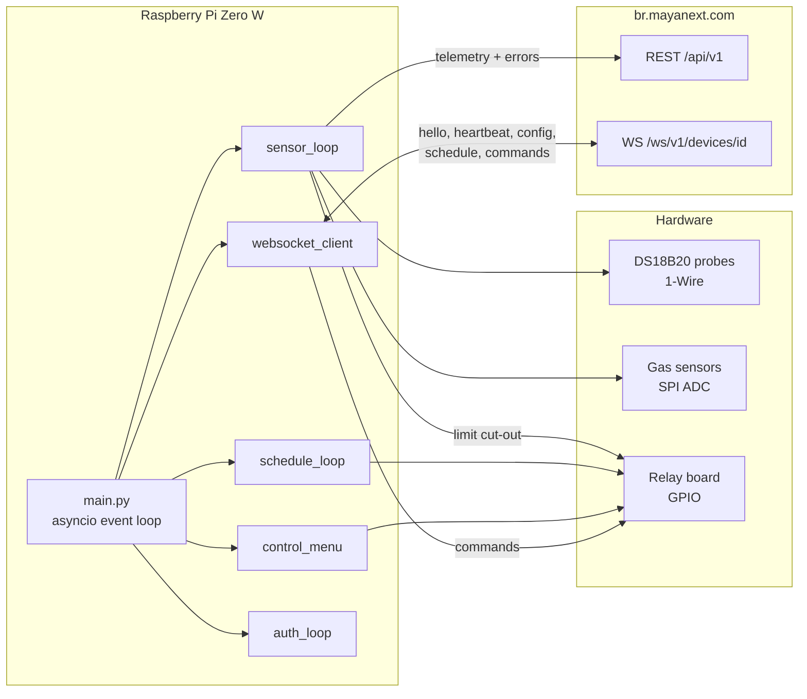
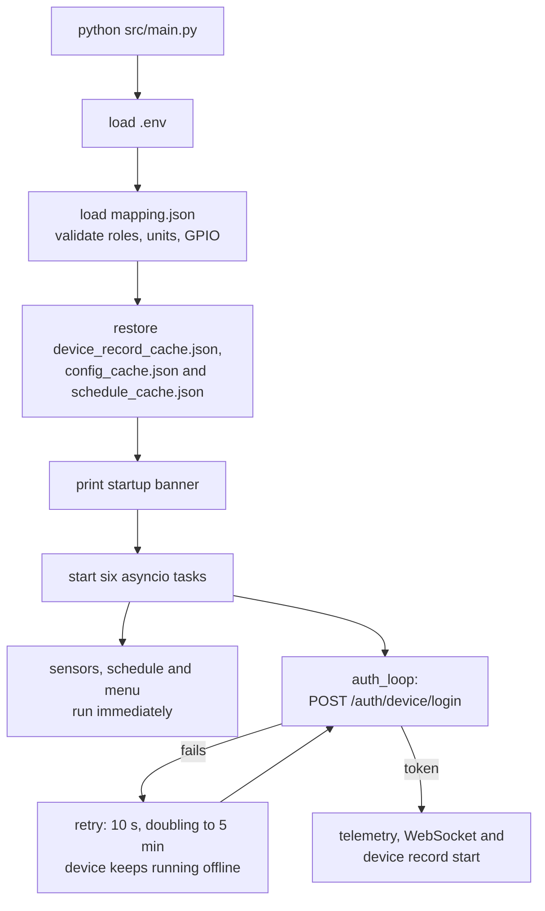
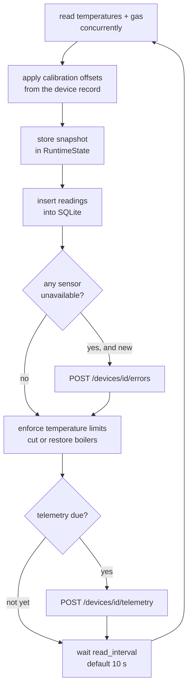
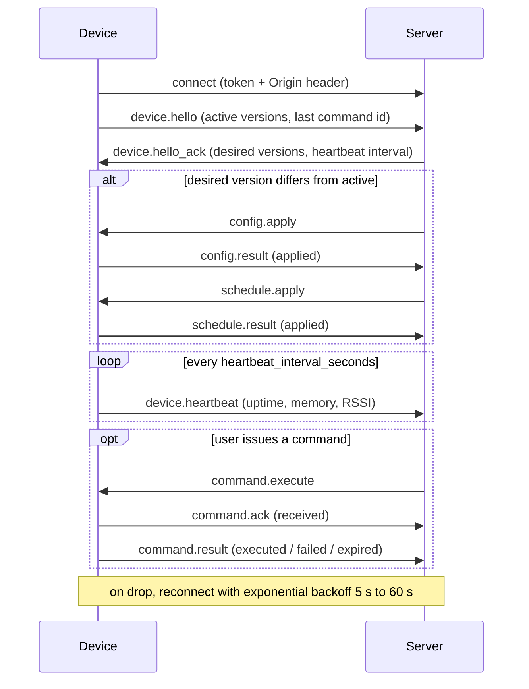
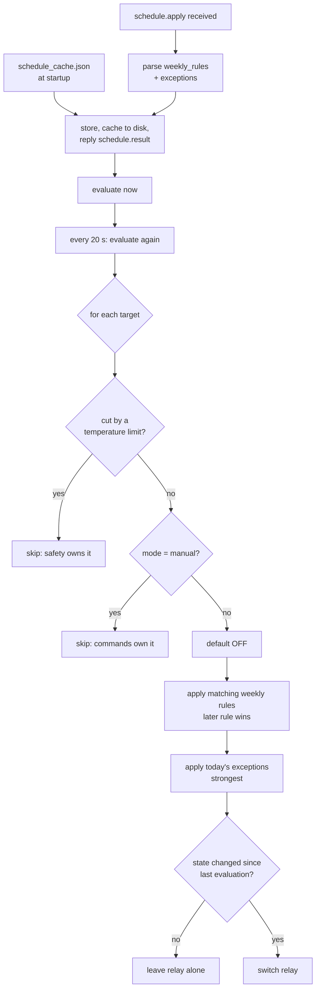
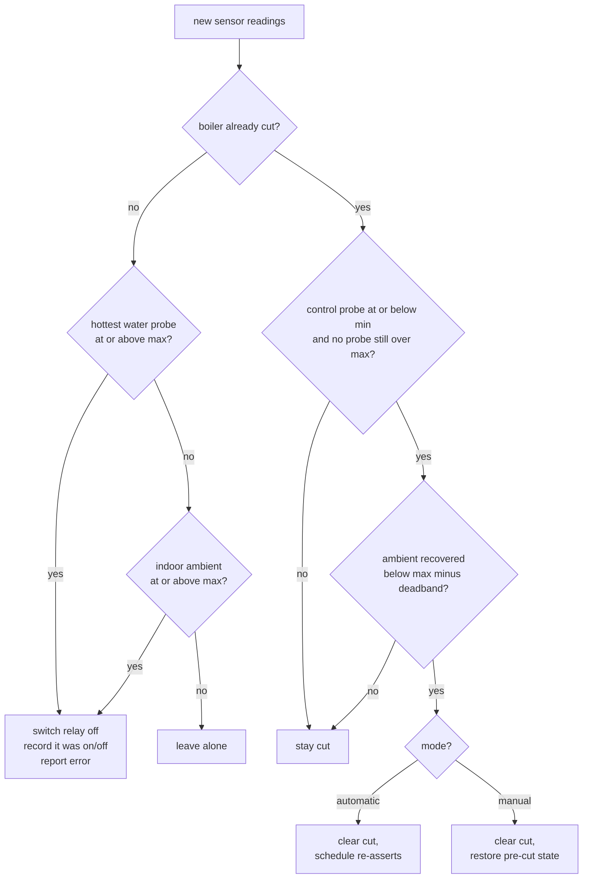

# boilerRoom-edge

Edge agent for the Smart Boiler Room platform. It runs on a Raspberry Pi in the
boiler room, reads temperature and gas sensors, drives relays, and keeps a live
link to the cloud over REST and WebSockets.

Server-side API contract: [`DEVICE.md`](DEVICE.md).

- **Target hardware:** Raspberry Pi Zero W — single-core ARMv6, 512 MB RAM, SD card
- **Python:** 3.11+ (uses `datetime.UTC`)
- **Dependencies:** `websockets`, `tzdata` (plus `RPi.GPIO` and `spidev` on real hardware)
- **Concurrency:** one asyncio event loop; every blocking call goes through
  `asyncio.to_thread` so nothing stalls the loop

---

## System overview



Five tasks run concurrently for the life of the process:

| Task | Responsibility |
|------|----------------|
| `sensor_loop` | Read all sensors, store history, report faults, enforce temperature limits, post telemetry |
| `websocket_client` | Realtime channel: hello, heartbeat, config, schedule, commands |
| `schedule_loop` | Re-evaluate the active schedule every 20 s and switch relays |
| `control_menu` | Interactive terminal menu for local inspection and control |
| `auth_loop` | Obtain a device session, retrying in the background until it succeeds |
| `device_record` | Poll `GET /devices/<id>` for calibration, sensor enable flags and cloud intent |

---

## Startup



**Startup never depends on the server being reachable.** Login runs as a
background task, so a boiler room that reboots during an outage still comes up
and runs its heating programme from the cached schedule. Telemetry and the
WebSocket wait on the session rather than blocking the boot; sensor polling,
schedule control, limit enforcement, reading history, and the control menu all
work without one. Missing credentials are reported once and not retried, since no
amount of waiting will supply them.

The device session token is used for **both** REST
(`Authorization: Device <token>`) and the WebSocket. There is no refresh
endpoint for devices — when the token nears expiry, or the server answers 401,
the agent simply logs in again.

---

## Sensor cycle



Limits are enforced *before* telemetry is built, so a cut is reported in the
same cycle it happens.

Telemetry is posted **once a minute**. `telemetry_interval_seconds` from the
server config overrides that once one has been received; until then the
one-minute default applies. Sensors are still read every `read_interval`
(10 s) — the extra cycles feed the local database, the limit guard and the
fault check, and only the upload is paced.

The first cycle after boot posts immediately rather than waiting out the
interval, so a restart is visible on the server straight away.

The due-check runs on read-cycle boundaries, so a post lands on the first cycle
*at or after* the minute mark — in practice 60–70 s apart, not exactly 60. The
server records `captured_at` from the payload, so the spacing is recorded
accurately rather than assumed.

The envelope follows the schema in `DEVICE.md`: `sensor_readings` with
`value`/`unit`/`status`, `boiler_states` and `pump_states` with `state` and
`mode`, the active config and schedule versions, `uptime_seconds`, and
`network` (`type`, `rssi_dbm`) where the host exposes a wireless interface.
Readings also carry `role`, `boiler_index`, and `equipment_unit` — additive
fields outside the documented schema that let the server correlate a reading
with the physical installation.

`errors` is deliberately **not** included. Errors go to
`POST /devices/<id>/errors`, where each entry is documented to become an alert;
repeating them in telemetry risks duplicates, and an empty `errors: []` on a
device that has just reported a fault would be misleading.

`device_status` is `normal`, `degraded` (a sensor is unavailable), or `unknown`
(no readings yet). The server stores this string without validating it, so the
vocabulary in `DEVICE.md` is the only guide.

---

## WebSocket session



The session is long-lived: it stays open and is kept alive by the heartbeat at
the interval `hello_ack` asks for (30 s). Reconnects back off exponentially from
5 s to 60 s, resetting once a session has survived 30 s — each attempt costs a
full TLS handshake, which is expensive on the Pi Zero W's single ARMv6 core, so
a server that rejects connections must not turn into a reconnect storm.

**Origin header is required.** The server runs Channels'
`AllowedHostsOriginValidator`, which rejects a handshake carrying no `Origin`
with `HTTP 403` *before* authentication is checked. Non-browser clients send
none by default, so the agent always sends one (`BOILERROOM_WS_ORIGIN`).

Implemented messages:

| Direction | Messages |
|-----------|----------|
| Device → server | `device.hello`, `device.heartbeat`, `command.ack`, `command.result`, `config.result`, `schedule.result`, `device.state` |
| Server → device | `device.hello_ack`, `config.apply`, `schedule.apply`, `command.execute` |

Supported commands: `boiler.turn_on/off`, `boiler.set_mode`, `pump.turn_on/off`,
`pump.set_mode`, `device.request_state`, `device.restart_service`,
`alarm.acknowledge_local`.

Command outcomes are cached by `command_id` (last 64) and replayed rather than
re-executed, because the server re-dispatches queued commands after every hello.

---

## Schedule evaluation



Two properties worth knowing:

- **Edge-triggered.** A relay is switched only when the computed state
  *changes*. A manual toggle from the control menu therefore survives until the
  next schedule transition instead of being reverted seconds later.
- **Mode-gated.** `boiler.set_mode manual` takes a target out of schedule
  control entirely; `automatic` hands it back and re-asserts immediately.

Targets map to relays through `mapping.json`: boiler *N* → unit `pot_N` → the
relay with role `pot`; pump *N* → the relay with role `pump`.

---

## Temperature limits

The limits in `config.apply` are enforced on every read cycle. A boiler is cut
when its water reaches `max_water_temperature_c` and comes back once it has
fallen to `min_water_temperature_c` — the gap between the two is a deadband, so
a boiler sitting at the limit does not chatter on and off.



A cut outranks everything: the scheduler will not switch a cut boiler on,
`boiler.turn_on` is refused, and the control menu refuses to toggle it.

Sensor selection matters:

- **Cut** uses the *hottest* of the unit's inlet and outlet probes, so a runaway
  on either one trips.
- **Restore** uses the *control* probe — outlet if the unit has one, otherwise
  inlet. Judging recovery on the hottest probe instead would let a warm return
  line hold a boiler off indefinitely, since return water commonly sits above
  `min_water_temperature_c`. A cut additionally will not clear while any probe
  is still over the maximum, so a stuck-hot sensor cannot cause chatter.
- **Ambient** uses `environment_inside` only. Outdoor temperature must never cut
  a boiler.

An unavailable sensor never counts as a cool boiler: a cut cannot clear without
a reading. It does not trip a cut by itself either, to avoid nuisance trips on a
flaky 1-Wire bus — the missing reading is reported as a sensor fault instead.

---

## Configuration

### `.env`

Copy `.env.example` to `.env` and fill in the device credentials. The file is
git-ignored.

| Variable | Default | Purpose |
|----------|---------|---------|
| `BOILERROOM_DEVICE_USERNAME` | — | Numeric device username from provisioning |
| `BOILERROOM_DEVICE_PASSWORD` | — | Numeric device password |
| `BOILERROOM_API_BASE_URL` | `https://br.mayanext.com` | REST base |
| `BOILERROOM_WS_BASE_URL` | `wss://br.mayanext.com` | WebSocket base |
| `BOILERROOM_WS_ORIGIN` | derived from WS base | `Origin` header for the handshake |
| `BOILERROOM_DEVICE_ID` | from login response | Pin the id used in REST/WS paths |
| `BOILERROOM_TOKEN_EXPIRY_BUFFER` | `60` | Re-login this long before token expiry |
| `BOILERROOM_WS_RECONNECT_DELAY` | `5` | Initial reconnect delay |
| `BOILERROOM_WS_RECONNECT_MAX_DELAY` | `60` | Backoff ceiling |
| `BOILERROOM_WS_SESSION_STABLE` | `30` | Session lifetime that resets backoff |
| `BOILERROOM_MAPPING_SOURCE` | `file` | `file` or `server` (server not implemented) |
| `BOILERROOM_MAPPING` | `mapping.json` | Mapping file path when source is `file` |
| `BOILERROOM_MAPPING_URL` | — | Mapping URL when source is `server` (not implemented) |
| `BOILERROOM_CONFIG_CACHE` | `config_cache.json` | Cached server config |
| `BOILERROOM_SCHEDULE_CACHE` | `schedule_cache.json` | Cached server schedule |
| `BOILERROOM_DEVICE_RECORD_CACHE` | `device_record_cache.json` | Cached device self-detail |
| `BOILERROOM_DATABASE` | `data/readings.db` | Local reading history |
| `BOILERROOM_DATA_RETENTION_DAYS` | `30` | Days of readings to keep (`0` = keep everything) |
| `BOILERROOM_MENU` | auto | `on`/`off`; defaults to on only when stdin is a TTY |
| `BOILERROOM_LOG_LEVEL` | `INFO` | Global log floor |
| `BOILERROOM_LOG_CONSOLE_LEVEL` | `OFF` | Set to a level name to also print records to the terminal |
| `BOILERROOM_LOG_LEVELS` | — | Per-subsystem levels, e.g. `ws=DEBUG,telemetry=WARNING` |
| `BOILERROOM_LOG_FILE` | `data/boilerroom.log` | Rotating log file |
| `BOILERROOM_LOG_MAX_BYTES` | `2097152` | Rotate at this size |
| `BOILERROOM_LOG_BACKUPS` | `3` | Rotated files to keep |
| `BOILERROOM_AMBIENT_HYSTERESIS` | `2.0` | Deadband for ambient limit recovery (°C) |
| `BOILERROOM_WATER_DEADBAND` | `5.0` | Recovery deadband when a config sets a max but no min water temperature (°C) |
| `BOILERROOM_FIRMWARE_VERSION` | `1.0.0` | Reported in `device.hello` |
| `BOILERROOM_HARDWARE_VERSION` | `edge-dev` | Reported in `device.hello` |

### `mapping.json` — physical wiring

Describes what is actually connected. This is **local** and cannot come from
`config.apply`, which carries no hardware addressing.

```jsonc
{
  "units": { "pot_1": { "name": "Pot 1" } },
  "temperature_sensors": {
    "1": {
      "physical_id": "28-000000000001",   // 1-Wire ROM code
      "role": "boiler_input_water",
      "unit": "pot_1",
      "sensor_id": "inlet-1"              // optional: the server's sensor_uid
    }
  },
  "gas_sensors": { "1": { "channel": 0, "role": "boiler_room", "unit": "pot_1" } },
  "relays": { "1": { "gpio": 17, "role": "pot", "unit": "pot_1" } }
}
```

**`sensor_id` links a probe to the server.** The platform knows sensors by the
`sensor_uid` registered for that boiler room at pairing time — visible in
`GET /devices/<id>`. A probe that declares one reports telemetry and errors
under that id, so the server matches readings to the sensor it has on file.

How many sensors exist, and what they are called, varies per installation: each
boiler room registers its own set. Any probe without a `sensor_id` falls back to
a local `temp-<n>` / `gas-<n>` reference, and its readings are still reported and
still stored in the local history — the server simply has no registered sensor to
attach them to. So a mapping may declare a `sensor_id` for every probe, some of
them, or none, depending on what that room registered.

Duplicate ids are rejected at load time, since two probes reporting the same uid
would overwrite each other server-side.

Roles are validated at load time:

- **Temperature:** `boiler_input_water`, `boiler_output_water`, `boiler_body`
  (all require a `unit`), `environment_inside`, `environment_outside`
- **Gas:** `boiler_room`, `gas_valve`, `exhaust`
- **Relay:** `pot`, `pump`, `circulation_pump`, `torch`, `fan`, `gas_valve`,
  `mixer`, `alarm`, `backup_heater`, `light`

### `data/readings.db` — local reading history

Every cycle's readings go into one SQLite database, in a single transaction.

```sql
readings(id, captured_at, sensor_kind, sensor_index, sensor_id,
         role, equipment_unit, value, unit, status)
```

`sensor_id` is the same identity telemetry reports, so history lines up with
what the server holds. An unavailable probe stores `NULL` with
`status = 'unavailable'`, which is distinguishable from a genuine zero.

```bash
sqlite3 data/readings.db \
  "SELECT captured_at, value FROM readings
   WHERE sensor_id='outlet-1' ORDER BY id DESC LIMIT 20;"
```

Tuned for SD cards: WAL journalling with `synchronous=NORMAL` (a crash cannot
corrupt the database; a power cut may lose the last transaction or two), and
hourly pruning of rows past the retention window so the file reaches a steady
size. Freed pages are reused, so no `VACUUM` — which would rewrite the whole
file — is ever needed.

Measured at **~152 bytes per row**: 10 sensors on the 10 s default is about
**12 MB/day**, or **375 MB** across the 30-day window. Lower
`BOILERROOM_DATA_RETENTION_DAYS` on a small card; `0` disables pruning, and the
file then grows without bound.

Menu option 7 reports row count, distinct sensors, file size, and the retained
time span.

### Logging

**Logs are written to `data/boilerroom.log`**, with rotated backups
`boilerroom.log.1` … `.3` beside it. Nothing is logged to the terminal: the
console belongs to the control menu, and event chatter scrolling past the
prompt makes it unusable.

```
2026-08-09 13:41:06,869 INFO    edge.ws          Connected (auth=query_token)
2026-08-09 13:41:19,482 INFO    edge.menu        Relay 1 switched on by operator
2026-08-09 13:26:53,350 WARNING edge.limits      CUT boiler 1 — water 84.3 °C ...
```

The console shows only the startup banner, the menu, and replies to what you
type — written with `RuntimeState.echo()`, which prints without creating a
record. Menu actions that change device state are echoed *and* logged, so the
file keeps a full account of what the operator did.

The `[tag]` each message already carried becomes its logger name, so verbosity
is tunable per subsystem without touching code:

```bash
BOILERROOM_LOG_LEVEL=INFO                        # global floor
BOILERROOM_LOG_LEVELS=ws=DEBUG,telemetry=WARNING # per subsystem
BOILERROOM_LOG_CONSOLE_LEVEL=WARNING             # also mirror to the terminal
```

Levels are decided by the loggers rather than the file handler, so an override
that *lowers* a threshold (`ws=DEBUG`) actually reaches the log instead of being
filtered out downstream.

Records are handed to a queue and written by a listener thread, so logging from
the event loop never waits on the SD card. Rotation caps growth at
`MAX_BYTES × (BACKUPS + 1)` — 8 MB by default. If the log file cannot be opened
(read-only or full card) the agent warns once and continues on console only.

**Menu option 10** tails the log from inside the agent. It reads backwards from
the end of the file rather than loading it whole, and reaches into rotated files
when you ask for more lines than the current one holds. The output is printed
rather than logged — routing it through the logger would append what you are
reading back into the file.

### `config_cache.json` and `schedule_cache.json` — last applied server documents

Written whenever the server pushes a new version, restored at startup. Together
they are what lets the device run unattended through a network outage: the
schedule keeps driving the relays on programme and the config keeps the
temperature limits enforced, with no server contact at all.

Both are written atomically (temp file + rename), so a power cut cannot leave a
half-written document behind, and only when the version actually changes, so a
re-pushed document costs no SD-card writes. A corrupt or unparseable cache is
ignored and the agent waits for a server push instead of failing to start.

Reporting the cached versions in `device.hello` also stops the server
re-pushing unchanged documents on every boot.

### `device_record_cache.json` — the server's record of this device

`GET /api/v1/devices/<id>` is the one REST endpoint a device token may *read*,
and it returns the platform's own record of this device. It carries three
things that arrive nowhere else — not in `config.apply`, not over the
WebSocket:

| From the record | What the agent does with it |
|-----------------|------------------------------|
| `sensors[].calibration.offset_c` | Added to each reading before anything consumes it |
| `sensors[].enabled` | A disabled probe is excluded from telemetry |
| `boiler_units[]` / `pump_units[]` `desired_*` vs `reported_*` | Logged as a divergence — never applied |
| `capabilities` | Compared against what `device.hello` declared |

Nothing pushes a calibration change, so the record is polled: once after login,
then every 15 minutes, and on demand from the control menu. It is cached to
disk on every successful fetch, so a device that boots during an outage still
applies the right offsets instead of silently reporting uncorrected readings.

**Calibration is applied at the top of the sensor cycle**, not at upload time.
The corrected value is what goes into SQLite, what the limit guard judges, and
what telemetry reports. Applying it only on the way out would leave the safety
cut working from numbers that appear nowhere else.

**A disabled sensor is still read, still stored, and still feeds the limit
guard** — only telemetry drops it. Disabling a probe in the cloud is an
instruction about reporting; letting it quietly remove a probe from the
over-temperature cut would turn a display preference into a safety change.

**Divergences are reported, not acted on.** The record shows what the cloud
wants (`desired_state`, `desired_mode`) next to what we last told it. Acting on
that here would race the command flow — the server re-dispatches queued
commands after every hello — and could flip a boiler to `manual`, taking it off
the schedule, without a command ever being issued. The agent logs the
difference at WARNING and leaves the relays alone.

The record is **not** a replacement for `mapping.json`. It has no 1-Wire ROM
code, no GPIO pin and no SPI channel, so physical addressing stays local; the
two are matched by `sensor_uid`.

---

## Running

```bash
pip install -r requirements.txt
cp .env.example .env      # then fill in the credentials
python src/main.py
```

`USE_MOCK_HARDWARE` at the top of [`src/main.py`](src/main.py) selects simulated
sensors and relays. Set it to `False` on the Pi, and install `RPi.GPIO` and
`spidev` there.

Mock temperatures are generated per role — indoor 18–28 °C, outdoor 5–35 °C,
inlet 30–60 °C, outlet 40–85 °C, body 40–90 °C — so limit enforcement behaves
realistically. One caveat when testing: a boiler cut for over-temperature will
not come back in mock mode, because the mock never produces outlet water below
the 30 °C minimum. It generates independent random readings rather than
simulating a boiler cooling down.

### Running as a service

```bash
sudo ./deploy/install.sh
```

The installer rewrites [`deploy/boilerroom-edge.service`](deploy/boilerroom-edge.service)
for this checkout — its path, the account owning it, and the `python3` on
`PATH` — then enables and starts it. It only adds the `gpio`/`spi`/`i2c`
supplementary groups that actually exist on the host, since systemd refuses to
start a unit naming a missing group.

```bash
sudo systemctl status boilerroom-edge
journalctl -u boilerroom-edge -f          # systemd's view
tail -f data/boilerroom.log               # the agent's own log
```

Three details make the service behave under systemd:

- **The control menu is switched off** (`BOILERROOM_MENU=off`, `StandardInput=null`).
  With no terminal, `input()` returns EOF immediately, the menu would read that
  as "operator chose quit", and the service would exit and be restarted
  forever. The agent also detects a non-TTY stdin by itself; the unit sets the
  variable explicitly rather than relying on that.
- **`SIGTERM` shuts down cleanly**, releasing relays and closing the database,
  so `systemctl stop` and `restart` do not skip cleanup.
- **Paths resolve against the project root**, not the working directory, so a
  relative `BOILERROOM_DATABASE=data/readings.db` does not become
  `/data/readings.db` when systemd starts the service from `/`.

`Restart=always` with `RestartSec=10` brings it back after a crash or reboot,
and `StartLimitBurst=5` in 5 minutes stops a crash loop from hammering the SD
card when the fault is something a restart cannot fix.

### Control menu

```
 1) Last sensor readings      6) Post telemetry now
 2) Show device mapping       7) Show app configuration
 3) Reload mapping from file  8) Report test error to server
 4) Change read interval      9) Show active schedule
 5) Relay status / control   10) Show recent log lines
                             11) Show server device record
                              0) Quit
```

Sensor polling and the WebSocket keep running while the menu is open — terminal
input is read in a worker thread.

Option 5 marks any boiler held off by a temperature limit as `[CUT: reason]` and
refuses to switch it on. Option 7 shows the active config, the limits, and which
boilers are currently cut. Option 10 tails the log file without leaving the
agent — useful over SSH on a headless Pi. Option 11 shows the server's record of
this device — calibration offsets, disabled probes, and where cloud intent
differs from what was last reported — and offers to re-fetch it on the spot,
which is the quickest way to confirm an installer's change has landed.

---

## Module map

| Module | Role |
|--------|------|
| `main.py` | Task startup, sensor loop, schedule loop |
| `auth.py` | Device login, token lifetime, authenticated REST calls |
| `ws_client.py` | WebSocket session, message handlers, heartbeat, backoff |
| `commands.py` | `command.execute` dispatch, idempotency, relay actuation |
| `schedule_runner.py` | Schedule parsing, evaluation, relay switching |
| `limits_guard.py` | Temperature limit cut-out and recovery |
| `json_store.py` | Atomic JSON read/write for the caches |
| `logging_setup.py` | Queue-backed console and rotating file logging |
| `device_config.py` | `config.apply` parsing and on-disk cache |
| `device_record.py` | `GET /devices/<id>` parsing, calibration, cache, divergence reporting |
| `telemetry_client.py` | Telemetry envelope construction and POST |
| `errors_client.py` | Fault detection and error reporting |
| `runtime_state.py` | Shared state across tasks, with locks |
| `control_menu.py` | Interactive terminal menu |
| `mapping.py`, `mapping_*.py`, `config.py` | Device mapping load, validation, lookup |
| `load_env.py` | Minimal `.env` reader (stdlib only) |
| `temperature_reader.py`, `gas_reader.py`, `relay_controller.py` | Hardware I/O |
| `mock_*.py` | Simulated hardware for development |
| `system_metrics.py` | Uptime, free memory, wifi RSSI for heartbeats |
| `data_logger.py` | SQLite reading history under `data/` |

---

## Status and known issues

Working: device login, telemetry, error reporting, device mapping, full
WebSocket protocol (hello, heartbeat, config, schedule, commands), schedule-driven
relay control, config and schedule caching, temperature limit enforcement,
offline operation, SQLite reading history, rotating log files,
systemd service, device self-detail with sensor calibration.

All four REST endpoints a device token may call are implemented:
`POST /auth/device/login`, `POST /devices/<id>/telemetry`,
`POST /devices/<id>/errors`, and `GET /devices/<id>`. The rest of the API
requires a user JWT or an installer/admin role.

Outstanding:

- **No gas threshold logic.** Gas readings are logged and transmitted, but no
  threshold drives the `alarm` relay or `gas_valve`.
- **`ServerMappingProvider` is unimplemented**; mapping is local-file only.
